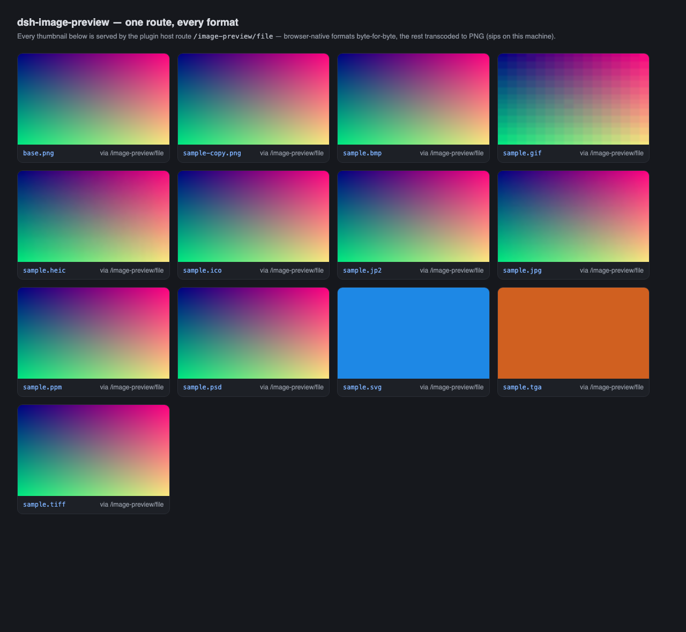
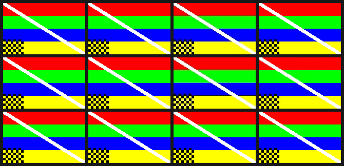

# dsh-image-preview

[](https://github.com/tianxia--/Dsh-ImageProview)
[](LICENSE)

Inline previews for the images your agent **already produced** — in the message flow, in any format.

## The problem

An image the agent reads never reaches the Chat flow. `read_image` (including through `run_code`) delivers its result as a synthetic `user/message` whose `source.kind` is not `"user"`, and `@deepseek-ai/dsh-client-ui-chat` classifies every such message as a `context` node:

```js
if (event.data.source.kind !== "user") return { kind: "context", ... }
```

`ContextInjectionRow` has no image seat, so the image block is dropped and only its descriptor text survives:

```
<path>/tmp/shot.png</path><type>image</type><content>image/png image, 840x2289 px, 972428 bytes</content>
```

Your own pasted images are fine (`source.kind === "user"` → `UserMessageNodeView` → thumbnails + lightbox). Only the agent's are lost. And because `read_image` admits **only** PNG/JPEG/WebP/GIF, a HEIC, TIFF, PSD, SVG, ICO, TGA or Netpbm file never becomes an attachment at all — it can only ever appear as a path.

## What this plugin does

| Case | Seat | Bytes |
|---|---|---|
| Agent image **attachment** (`read_image`) | new `agent-image` chat node | already in the durable attachment store; no extra I/O |
| Message that only **names** an image file | new `agent-image-path` chat node | host routes `/image-preview/meta` + `/image-preview/file` |

Both render through `renderMessageImages` — the seat `ChatView` passes to *every* keyed node renderer — so the thumbnail sizing, the load/retry state and the full-size lightbox are the official `ui-attachment` ones. No image UI is reimplemented, and no official component is overridden: conversation Definitions are not exclusive, so these rows are **added beside** the existing text rows.

Refresh the page and past sessions light up too: the projection is rebuilt from the session log.

## Screenshots

Every format, one host route — each thumbnail below is the real `/image-preview/file` response rendered in a browser (native formats byte-for-byte, the rest transcoded to PNG):



Pixel fidelity of the same round trip, decoded and compared against the source (see [Measured fidelity](#measured-fidelity)):



## Formats

**Served byte-for-byte** (the browser renders them): PNG · JPEG · GIF · WebP · AVIF · BMP · ICO/CUR · SVG

**Transcoded to PNG on the host**: HEIC/HEIF · TIFF · PSD · JP2/J2K · TGA · Netpbm (PBM/PGM/PPM/PAM) · EXR · DDS · JXL

The chain is `sips` (macOS, always present) → `magick` → `convert` → `ffmpeg`, plus **built-in zero-dependency TGA and Netpbm decoders** so those two keep working on a machine with none of them. Results are cached under `$DSH_HOME/plugins-cache/image-preview`, keyed by path + mtime + size, pruned at 240 entries. A format with no available transcoder answers `no-transcoder` and renders nothing rather than a broken frame.

### Measured fidelity

`test/visual.test.mjs` builds one source pattern (pure R/G/B/Y bands, a diagonal, a checker), converts it to every format, fetches it back **through the real route over HTTP**, decodes the served payload and compares it to the source. Mean absolute error per channel (0 = identical), from this machine:

| Format | Served as | MAE | |
|---|---|---|---|
| PNG · GIF · BMP | native | **0** | lossless |
| TIFF · PSD · TGA · Netpbm | PNG | **0** | lossless transcode |
| EXR | PNG | **0.08** | HDR round trip |
| JP2 | PNG | 3.32 | lossy codec |
| JPEG | native | 7.30 | lossy codec |
| HEIC | PNG | 7.55 | lossy codec |

Every format is also compared against a vertically flipped and a red/blue-swapped copy of the source; in each case the straight comparison wins by 15–40×, which is what rules out the two mistakes a hand-written decoder actually makes. The built-in TGA decoder (bottom-left origin **and** BGR order) and the Netpbm decoder are measured separately at MAE 0, because the chain always reaches `sips` first on macOS and would otherwise hide them.

**Not verified here**: DDS (this macOS build's `sips` writes a zero-byte file, so no fixture could be produced — the suite reports it as skipped) and JXL (`sips --formats` lists it readable but not writable). PDF was **removed** in 0.2.0: a document's rasterization DPI is a choice, not a property, and a measured round trip came back at MAE 34.

## Security model

The browser cannot read local disk; this route can, so it refuses by default:

- the resolved **realpath** must sit under an allowed root — every workspace the host knows about (`ctx.workspaceRegistry`), the OS temp dirs, `$DSH_HOME`, plus any `allowRoots` you configure. Symlinks are resolved *before* the check, so a link out of the workspace does not escape it.
- the extension must be in the allowlist **and** the leading bytes must sniff as a real image — a shell script named `.png` is refused (`not-an-image`).
- a relative path is only resolved when the client supplies the conversation `cwd`.
- `maxBytes` (default 128 MiB) caps the source file; responses carry `x-content-type-options: nosniff` and `content-disposition: inline`.
- **cross-site requests are refused.** Plugin routes are mounted outside `dsh web`'s cookie gate — `@liustack/modlens`'s paste route answers an unauthenticated request too — so this route does not lean on it. The server binds loopback, which leaves one reachable attacker: a web page in your browser pointing an `` at the route. It cannot read the pixels (tainted canvas), but load/error timing would let it probe which files exist, so a request labelled cross-site by Fetch Metadata is rejected. A caller sending no Fetch Metadata (curl, a local script) is served: it can already read those files directly.

## Install

```sh
# from this repository
dsh plugin --profile web add github:tianxia--/Dsh-ImageProview

# or from npm, once published
dsh plugin --profile web add dsh-image-preview

# or from a local checkout
dsh plugin --profile web add link:/path/to/Dsh-ImageProview
```
Or wire it by hand:

```yaml
# ~/.dsh/profiles/web/cordis.patch.yml
- insert:
    - id: image-preview
      name: dsh-image-preview
      config:
        maxBytes: 134217728      # optional, default 128 MiB
        allowRoots: []           # optional extra roots
        transcode: true          # false = native formats only
```

The host half mounts the routes; the browser half (`lib/client.js`) is hand-written in the lazy-CJS client plugin protocol — no build step, no dependencies.

## Verify

```sh
npm test   # 164 checks: 50 host-route, 15 real-HTTP, 46 client-bundle, 53 pixel-fidelity
```

The host suite generates 13 fixtures (via `sips` where available) and drives the real handlers with fake req/res pairs; the client suite loads the real bundle with a stubbed module loader and drives both Definitions with event shapes copied out of a durable session log.

## Known limits

- **The text row stays.** The image row is added next to the original `<path>` context row rather than replacing it: overriding the official `context` key would mean reimplementing `ContextInjectionRow` (provenance chips, collapse state) for no visual gain.
- **Tool results are not scanned.** A path printed by `bash` inside a tool result is not previewed; only user/assistant message text and attachments are.
- **The lightbox is the official one** — fit-to-viewport, no zoom or pan. If you want a zooming viewer with its own fence syntax, [img-preview](https://github.com/dhb861832993-star/img-preview) covers that ground and the two coexist.
- **Transcoding depends on the host machine.** Without `sips`/ImageMagick/ffmpeg, only the built-in TGA and Netpbm decoders remain.

## License

MIT
